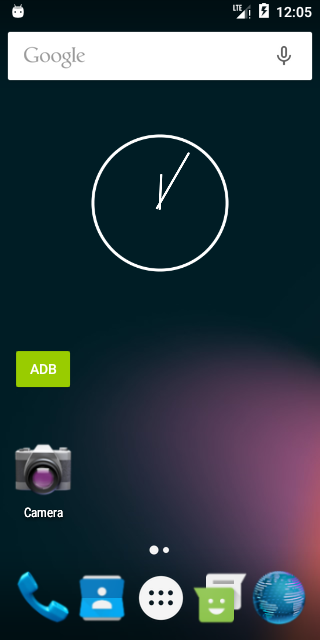

ADBio is an Android app and widget that enables/disables the Android Debug
Bridge (ADB).

# Images

# Install

    git clone https://github.com/yoshi1123/adbio.git
    cd adbio
    ./setup_signing_key.sh
    ./gradlew assembleRelease
    adb install ./build/outputs/apk/release/adbio-release.apk
